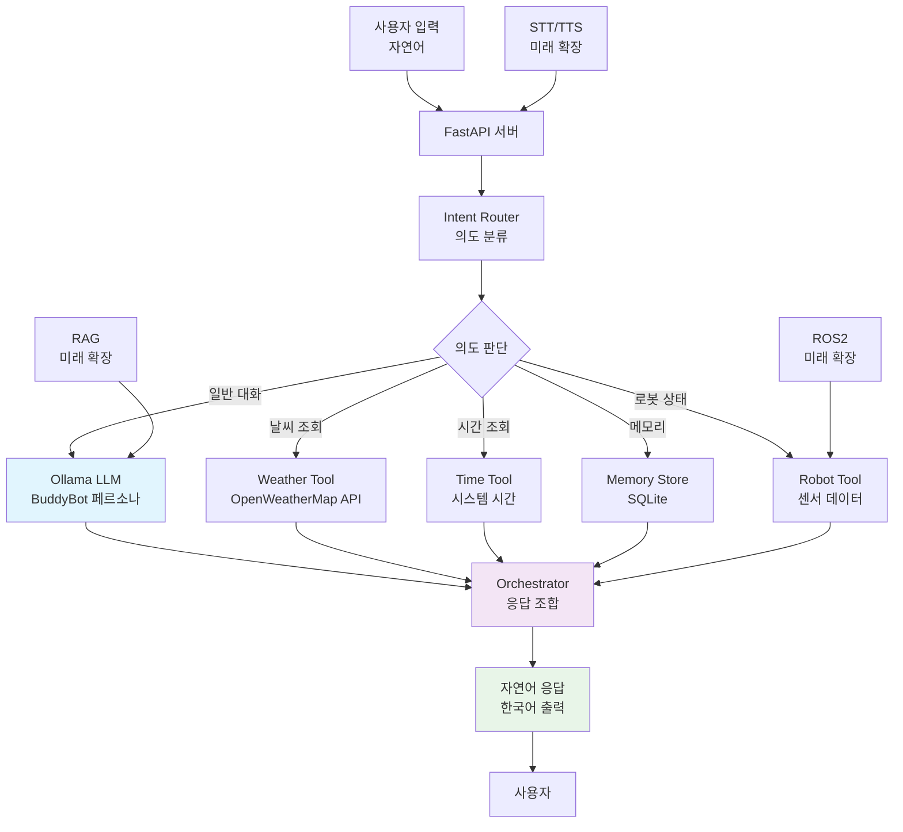

# 🤖 BuddyBot AI

**Jarvis 스타일의 로컬 AI 비서 서버**  
*Raspberry Pi 5 기반 BuddyBot 로봇의 AI 서버 역할을 수행합니다.*

[](https://www.python.org/)
[](https://fastapi.tiangolo.com/)
[](https://ollama.ai/)

## 📋 프로젝트 개요

BuddyBot은 **자연어 기반 AI 비서**로, 명령어 대신 평범한 대화로 로봇을 제어하고 정보를 얻을 수 있습니다.

### 🎯 주요 특징
- **자연어 대화**: "안녕"부터 "서울 날씨 알려줘"까지 평범한 말로 소통
- **로컬 우선**: 인터넷 연결 없이도 동작하는 로컬 AI
- **모듈러 설계**: 각 기능이 독립적으로 확장 가능
- **안전성**: 정책 엔진으로 위험한 명령 차단

### 🛠️ 기술 스택
- **플랫폼**: Ubuntu 24.04
- **하드웨어**: RTX 4070 Ti (VRAM 11GB)
- **LLM**: Ollama 기반 qwen2.5:7b
- **프레임워크**: FastAPI
- **저장소**: SQLite
- **STT/TTS**: faster-whisper, Piper (향후 구현)
- **로봇 연동**: ROS2 bridge 준비 (현재 mock)

## �️ 서버 관리

### 서버 시작하기

BuddyBot 서버를 시작하는 방법은 여러 가지가 있습니다:

#### 방법 1: 개발 모드 (권장)
```bash
# 자동 재시작 및 디버그 모드
./scripts/dev_run.sh
```

#### 방법 2: 직접 실행
```bash
# 기본 실행
uvicorn app.main:app --host 0.0.0.0 --port 8000

# 개발 모드 (자동 재시작)
uvicorn app.main:app --host 0.0.0.0 --port 8000 --reload

# 백그라운드 실행 (추천: 같은 터미널에서 CLI 사용 가능)
uvicorn app.main:app --host 0.0.0.0 --port 8000 &
```

#### 방법 3: Docker 사용
```bash
# Docker Compose로 실행
docker-compose up --build

# 백그라운드 실행
docker-compose up -d --build
```

### 서버 중지하기

#### 일반적인 중지
```bash
# 터미널에서 실행 중이라면 Ctrl+C
# 또는 프로세스 찾기
ps aux | grep uvicorn
kill <프로세스ID>
```

#### 포트로 중지
```bash
# 포트 8000 사용 프로세스 찾기
lsof -i :8000

# 강제 종료
kill -9 <프로세스ID>
```

#### Docker 중지
```bash
# Docker Compose 중지
docker-compose down

# 컨테이너 중지
docker stop <컨테이너ID>
```

### 서버 상태 확인

#### 건강 상태 확인
```bash
# API 상태 확인
curl http://localhost:8000/health

# 응답 예시
{
  "status": "healthy",
  "ollama": "connected",
  "sqlite": "connected"
}
```

#### 프로세스 상태 확인
```bash
# 서버 프로세스 확인
ps aux | grep uvicorn

# 포트 사용 확인
netstat -tlnp | grep 8000
```

#### 로그 확인
```bash
# 서버 로그 실시간 확인
tail -f /tmp/buddybot.log

# 최근 로그 50줄
tail -50 /tmp/buddybot.log

# Docker 로그
docker-compose logs -f
```

### 자주 사용하는 명령어

```bash
# 빠른 서버 시작 (백그라운드)
./scripts/dev_run.sh &

# 상태 확인
curl http://localhost:8000/health

# CLI로 테스트 (같은 터미널에서 가능)
python scripts/chat_cli.py

# 로그 확인
tail -f /tmp/buddybot.log

# 서버 중지
pkill -f uvicorn
```

## �💬 사용법

### 자연어 대화 예시

터미널에서 `python scripts/chat_cli.py` 실행 후:

```
🤖 BuddyBot과 대화를 시작합니다! (종료하려면 'exit' 입력)
--------------------------------------------------
나: 안녕 버디봇
🤖 BuddyBot: 안녕하세요! 무엇을 도와드릴까요?

나: 오늘 서울 날씨 어때?
🤖 BuddyBot: 현재 서울은(는) 맑음 상태이고 기온은 15°C입니다.

나: 지금 몇 시야?
🤖 BuddyBot: 현재 시각은 2024-01-01 14:30:00 UTC입니다.

나: 라이다 테스트 기억해줘
🤖 BuddyBot: 알겠습니다. '라이다 테스트'를 저장해둘게요.

나: 뭐 저장했지?
🤖 BuddyBot: 저장된 내용은 '라이다 테스트'입니다.

나: 배터리 얼마 남았어?
🤖 BuddyBot: 현재 배터리는 85%, 모드는 idle입니다.

나: exit
🤖 BuddyBot: 안녕히 가세요!
```

### 지원 기능 상세

| 기능 | 자연어 예시 | 설명 |
|------|-------------|------|
| **일반 대화** | "안녕", "오늘 기분 어때?" | Ollama LLM으로 자유 대화 |
| **시간 조회** | "지금 몇 시야?", "현재 시각 알려줘" | 시스템 시간 확인 |
| **날씨 조회** | "서울 날씨 어때?", "부산 기온 알려줘" | OpenWeatherMap API 사용 |
| **메모리 저장** | "회의 일정 기억해줘", "중요한 거 저장해" | SQLite에 저장 |
| **메모리 조회** | "뭐 저장했어?", "기억한 거 불러와" | 저장된 내용 확인 |
| **로봇 상태** | "배터리 얼마야?", "로봇 상태 확인해" | 배터리, 모드 등 확인 |
| **로봇 명령** | "정지해", "충전대로 가" | 정책 검사 후 실행 (mock) |

## 🚀 빠른 시작 (5분만에 실행하기)

### 1단계: 환경 준비
```bash
# Python 가상환경 생성 및 활성화
python3 -m venv buddybot-env
source buddybot-env/bin/activate  # Linux/Mac
# buddybot-env\Scripts\activate   # Windows
```

### 2단계: 프로젝트 다운로드 및 설치
```bash
# 의존성 설치
pip install -r requirements.txt
```

### 3단계: 환경변수 설정
```bash
# .env 파일 생성
cp .env.example .env

# .env 파일 편집 (필수 설정만)
# OPENWEATHER_API_KEY=your_api_key_here  # 날씨 기능용
# 나머지는 기본값으로 OK
```

### 4단계: Ollama 설치 및 모델 준비
```bash
# Ollama 설치 (Ubuntu/Debian)
curl -fsSL https://ollama.ai/install.sh | sh

# qwen2.5:7b 모델 다운로드 (약 4GB)
ollama pull qwen2.5:7b

# Ollama 서버 백그라운드 실행
ollama serve
```

### 5단계: 서버 실행
```bash
# 방법 1: 개발 모드 (자동 재시작)
./scripts/dev_run.sh

# 방법 2: 직접 실행
uvicorn app.main:app --host 0.0.0.0 --port 8000 --reload
```

### 6단계: 테스트하기

서버를 백그라운드에서 실행한 경우, 같은 터미널에서 CLI로 대화할 수 있습니다:

```bash
# CLI 클라이언트 실행 (같은 터미널에서 가능)
python scripts/chat_cli.py

# 또는 직접 실행
./scripts/chat_cli.py
```

**💡 터미널 관리 팁:**
- **하나의 터미널로 모두 실행**: 서버를 백그라운드(`&`)로 실행하면 같은 터미널에서 CLI 사용 가능
- **별도 터미널 선호**: `tmux`나 `screen`으로 멀티플렉싱하거나, VS Code의 터미널 분할 사용
- **서버만 실행**: API만 사용하고 CLI는 사용하지 않을 경우

**🎉 성공! 이제 자연어로 BuddyBot과 대화할 수 있습니다!**

## API 엔드포인트

### GET /health
서버 상태 확인 (Ollama, SQLite 연결 상태)

**응답 예시:**
```json
{
  "status": "healthy",
  "ollama": "connected",
  "sqlite": "connected"
}
```

### POST /chat
자연어 기반 대화 및 도구 자동 호출

**요청:**
```json
{
  "message": "서울 날씨 알려줘"
}
```

**응답:**
```json
{
  "response": "현재 서울은(는) 연무 상태이고 기온은 12.7°C입니다."
}
```

**추가 예시:**

- 시간: `"지금 몇 시야?"` → `"현재 시각은 2024-01-01 15:32:00 UTC입니다."`
- 메모리 저장: `"라이다 테스트 기억해줘"` → `"알겠습니다. '라이다 테스트'를 저장해둘게요."`
- 메모리 조회: `"뭐 저장했지?"` → `"저장된 내용은 '라이다 테스트'입니다."`
- 로봇 상태: `"배터리 상태 어때?"` → `"현재 배터리는 85%, 모드는 idle입니다."`
- 일반 대화: `"안녕하세요"` → `"안녕하세요! 무엇을 도와드릴까요?"`

### GET /time
현재 시간 조회

**쿼리 파라미터:**
- `timezone` (optional): 타임존 (예: Asia/Seoul)

**응답:**
```json
{
  "time": "2024-01-01 12:00:00 UTC"
}
```

### GET /weather
날씨 조회

**쿼리 파라미터:**
- `city`: 도시명

**응답:**
```json
{
  "city": "Seoul",
  "raw_data": {...},
  "summary": "서울의 현재 날씨는 맑음, 온도는 15°C입니다."
}
```

### POST /memory/save
메모리 저장

**요청:**
```json
{
  "key": "reminder",
  "value": "내일 회의 2시"
}
```

### GET /memory/get
메모리 조회

**쿼리 파라미터:**
- `key`: 키

**응답:**
```json
{
  "key": "reminder",
  "value": "내일 회의 2시"
}
```

### GET /robot/status
로봇 상태 조회 (mock)

**응답:**
```json
{
  "battery": 85,
  "mode": "idle",
  "estop": false,
  "nav_state": "docked"
}
```

### POST /robot/command
로봇 명령 실행 (mock, 정책 검사)

**요청 예시:**
```json
{
  "command": "stop"
}
```

**응답:**
```json
{
  "success": true,
  "message": "Robot stopped"
}
```

## 🔧 고급 설정

### 환경변수 상세

`.env` 파일에 설정 가능한 변수들:

```bash
# 필수 (날씨 기능 사용 시)
OPENWEATHER_API_KEY=your_openweather_api_key

# 선택 (기본값 사용 가능)
OLLAMA_BASE_URL=http://localhost:11434      # Ollama 서버 주소
OLLAMA_MODEL=qwen2.5:7b                     # 사용할 LLM 모델
SQLITE_PATH=./data/buddybot.db              # 데이터베이스 경로
BUDDYBOT_BASE_URL=http://localhost:8000     # API 서버 주소 (CLI용)
```

### API 직접 사용

cURL로 직접 API 호출하기:

```bash
# 일반 대화
curl -X POST http://localhost:8000/chat \
  -H "Content-Type: application/json" \
  -d '{"message":"안녕하세요"}'

# 날씨 조회
curl -X POST http://localhost:8000/chat \
  -H "Content-Type: application/json" \
  -d '{"message":"서울 날씨 알려줘"}'

# 시간 조회
curl -X POST http://localhost:8000/chat \
  -H "Content-Type: application/json" \
  -d '{"message":"지금 몇 시야?"}'
```

### Docker 사용

```bash
# Docker Compose로 실행
docker-compose up --build

# 백그라운드 실행
docker-compose up -d --build
```

## 🧪 테스트 및 검증

### 자동 테스트 실행
```bash
# 모든 테스트 실행
pytest

# 특정 테스트만 실행
pytest tests/test_health.py
pytest tests/test_memory.py
```

### 수동 테스트
```bash
# 스모크 테스트 (기본 기능 검증)
./scripts/smoke_test.sh
```

### 건강 상태 확인
```bash
# 서버 상태 확인
curl http://localhost:8000/health
```

## 🚨 문제 해결

### 자주 발생하는 문제들

**1. Ollama 연결 실패**
```bash
# Ollama 상태 확인
ollama list

# Ollama 재시작
ollama serve
```

**2. 날씨 API 키 오류**
```bash
# OpenWeatherMap에서 무료 API 키 발급
# https://openweathermap.org/api
# .env 파일에 OPENWEATHER_API_KEY 설정
```

**3. 포트 충돌**
```bash
# 다른 포트 사용
uvicorn app.main:app --host 0.0.0.0 --port 8001
```

**4. 메모리 부족**
- qwen2.5:7b 대신 작은 모델 사용
- `OLLAMA_MODEL=qwen2.5:3b`로 변경

### 로그 확인
```bash
# 서버 로그 확인
tail -f /tmp/buddybot.log
```

## 🏗️ BuddyBot AI 아키텍처



### 아키텍처 설명 (졸작 발표용)

**1. 사용자 입력 계층**
- 자연어 입력 (음성/텍스트)
- CLI, API, 웹 인터페이스 지원

**2. AI 처리 계층**
- **Intent Router**: 자연어 의도 분류 (룰 기반)
- **Ollama LLM**: BuddyBot 페르소나 기반 응답 생성
- **Tool System**: 외부 API 및 하드웨어 제어

**3. 데이터 계층**
- **Memory Store**: SQLite 기반 사용자 메모리
- **Configuration**: 환경변수 기반 설정 관리

**4. 확장 계층 (미래)**
- **ROS2**: 실제 로봇 제어
- **RAG**: 문서 기반 Q&A
- **STT/TTS**: 음성 인터페이스

### 기술적 특징

- **모듈러 설계**: 각 컴포넌트 독립적 교체 가능
- **로컬 우선**: 인터넷 연결 불필요
- **안전성**: 정책 엔진으로 위험 명령 차단
- **확장성**: 새로운 tool 및 기능 쉽게 추가

### 프로젝트 구조

```
buddybot-ai/
├── app/                    # 메인 애플리케이션
│   ├── main.py            # FastAPI 앱 진입점
│   ├── config.py          # 환경변수 설정
│   ├── dependencies.py    # 의존성 주입
│   ├── logger.py          # 로깅 설정
│   ├── api/               # API 라우터
│   │   ├── routes_chat.py     # 채팅 API
│   │   ├── routes_health.py   # 건강 상태 API
│   │   └── ...
│   ├── core/              # 핵심 로직
│   │   ├── orchestrator.py    # 메인 오케스트레이터
│   │   ├── intent_router.py   # 의도 분류
│   │   └── policy_engine.py   # 정책 엔진
│   ├── llm/               # LLM 클라이언트
│   ├── tools/             # 도구들
│   ├── memory/            # 메모리 저장소
│   ├── schemas/           # 데이터 모델
│   ├── stt/               # STT 서비스 (준비중)
│   └── tts/               # TTS 서비스 (준비중)
├── scripts/               # 유틸리티 스크립트
│   ├── dev_run.sh         # 개발 서버 실행
│   ├── smoke_test.sh      # 스모크 테스트
│   └── chat_cli.py        # CLI 채팅 클라이언트
├── tests/                 # 테스트 코드
├── data/                  # 데이터 디렉토리
├── requirements.txt       # Python 의존성
├── Dockerfile             # Docker 설정
├── docker-compose.yml     # Docker Compose
└── README.md              # 이 파일
```

## 🔮 향후 계획

- **STT/TTS 연동**: 음성 입력/출력
- **RAG 기능**: 문서 기반 Q&A
- **ROS2 통합**: 실제 로봇 제어
- **멀티모달**: 이미지 인식
- **웹 UI**: 브라우저 기반 인터페이스

## 🤝 기여하기

1. Fork this repository
2. Create your feature branch (`git checkout -b feature/AmazingFeature`)
3. Commit your changes (`git commit -m 'Add some AmazingFeature'`)
4. Push to the branch (`git push origin feature/AmazingFeature`)
5. Open a Pull Request

## 📄 라이선스

이 프로젝트는 MIT 라이선스 하에 있습니다.

## 🙋‍♂️ 문의

질문이나 제안사항이 있으시면 Issue를 열어주세요!

---

**BuddyBot으로 즐거운 AI 경험 되세요! 🚀**